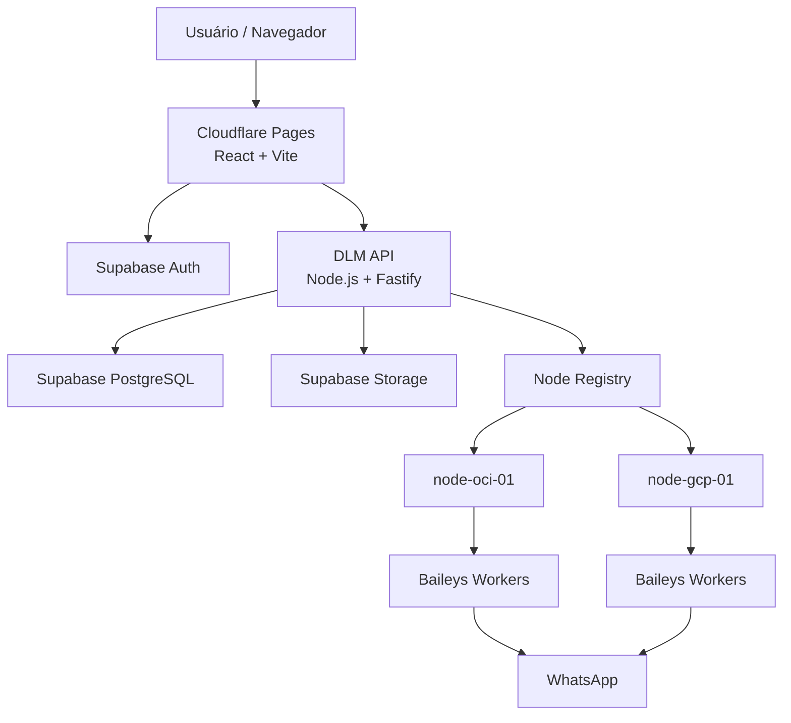
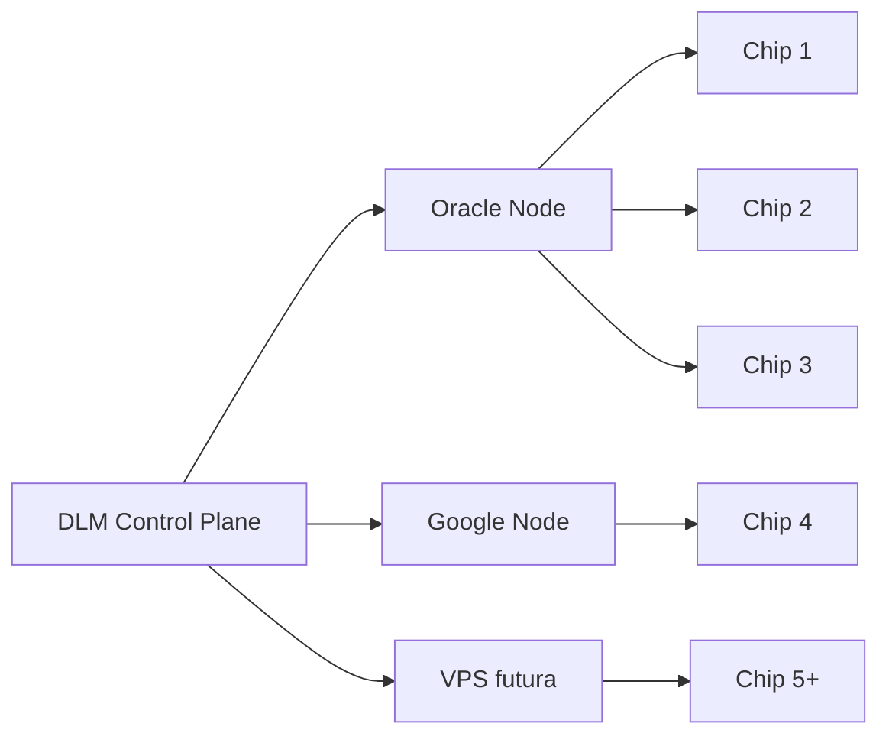
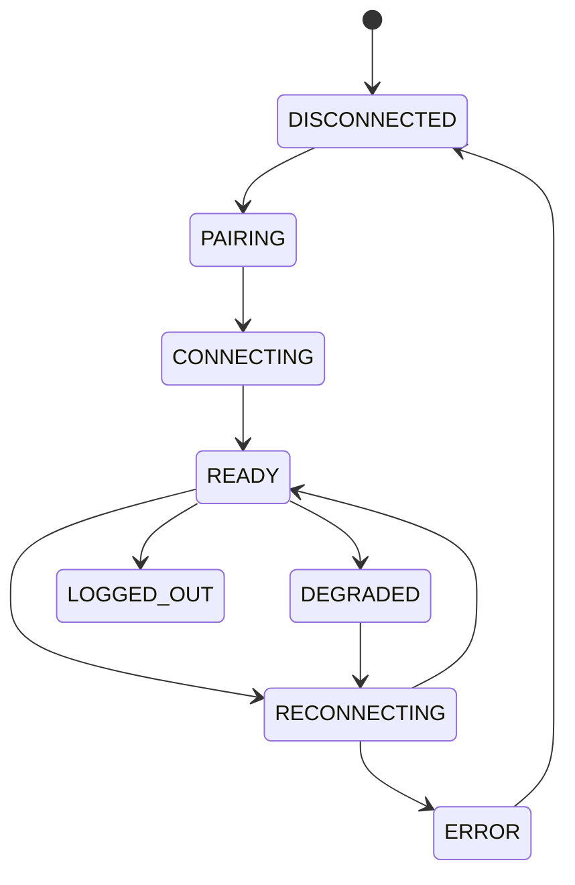
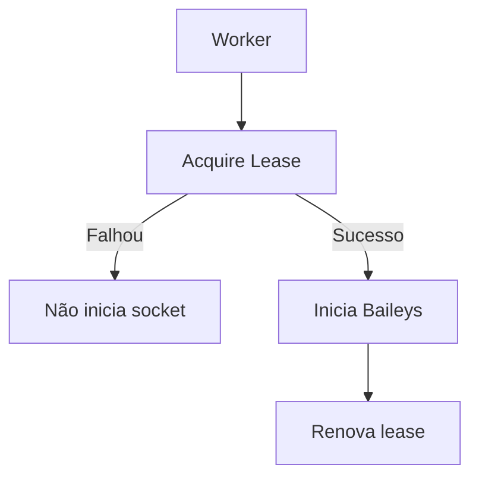
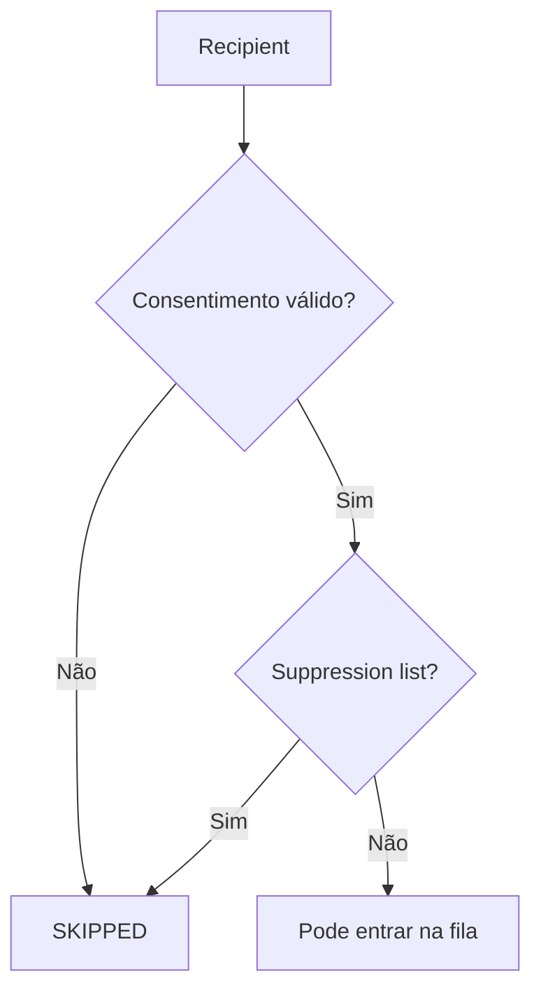
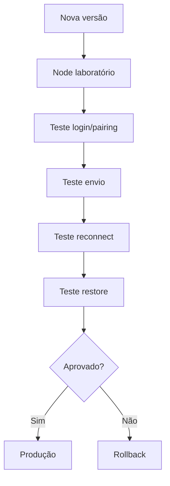
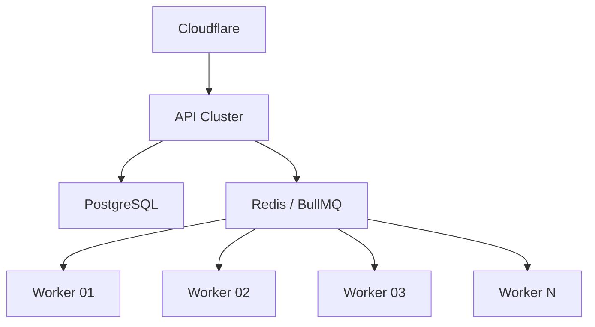
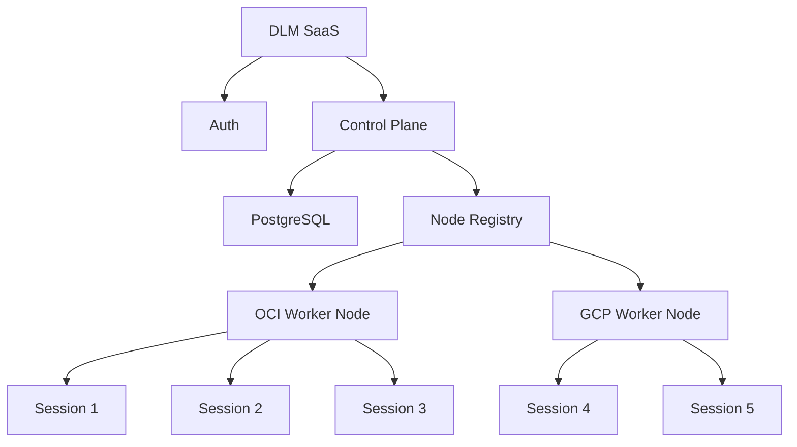

# DLM WhatsApp — Documentação Técnica Mestre

<aside>
📚

**Documento Mestre — DLM WhatsApp SaaS**

Arquitetura, produto, segurança, banco de dados, autenticação, multi-tenant, multi-chip, multi-node, campanhas, infraestrutura gratuita, deploy, observabilidade, backup, testes e roadmap.

</aside>

**Versão:** 1.0  

**Status:** Arquitetura proposta / pré-implementação  

**Data-base:** 01/10/2026  

**Objetivo inicial:** operar o MVP com custo de infraestrutura próximo de **R$ 0/mês**, respeitando as cotas e termos vigentes dos provedores.

---

# 1. Visão do Produto

O **DLM WhatsApp — Central Multi-Chip Ultra-Leve** será um SaaS web para centralizar múltiplas conexões WhatsApp, usuários, organizações, contatos, listas, campanhas autorizadas, filas, workers, auditoria e métricas em uma única plataforma.

O produto deve nascer como:

- SaaS **multi-tenant**;
- multiusuário com RBAC;
- **multi-chip**;
- **multi-node**;
- ultraleve;
- sem Chromium/Puppeteer no núcleo;
- preparado para VMs gratuitas;
- preparado para migração futura para infraestrutura paga sem reescrita;
- com isolamento de sessão, tenant e worker;
- com auditoria e observabilidade;
- com consentimento, opt-out e suppression list.

<aside>
⚠️

**Princípio de uso:** o sistema deve operar com destinatários autorizados e respeitar consentimento, opt-out e regras aplicáveis do provedor. Não fazem parte do produto mecanismos de evasão de bloqueios, anti-ban ou técnicas para contornar controles da plataforma.

</aside>

## 1.1 Objetivos

1. Centralizar conexões WhatsApp em uma interface SaaS.
2. Permitir organizações isoladas.
3. Permitir múltiplos chips por organização.
4. Distribuir conexões entre múltiplos servidores.
5. Criar campanhas, contatos, listas, agendamentos e histórico.
6. Manter sessões persistentes e restauráveis.
7. Iniciar com infraestrutura gratuita.
8. Evoluir para arquitetura comercial sem trocar o domínio central.

## 1.2 Não objetivos da V1

- Kubernetes.
- Kafka.
- RabbitMQ.
- Redis Cluster.
- Microsserviços complexos.
- Billing automático.
- Aplicativo mobile.
- CRM completo.
- IA generativa no núcleo.
- White-label.
- Multi-region database.
- Analytics avançado.

---

# 2. Princípios Arquiteturais

## 2.1 Multi-tenant desde o primeiro commit

Toda entidade operacional relevante deverá possuir ou derivar um **organization_id**.

Entidades principais: organizations, organization_members, whatsapp_connections, contacts, contact_lists, campaigns, campaign_recipients e audit_logs.

## 2.2 Domínio desacoplado do WhatsApp

O código de negócio não deve chamar diretamente funções específicas da biblioteca de conexão. O domínio deve conversar com uma abstração **MessagingProvider**.

Implementação inicial:

- MessagingProvider
    - BaileysProvider

Implementações futuras poderão coexistir sem reescrever campanhas, contatos ou regras de negócio.

## 2.3 Isolamento por conexão

Cada chip deve possuir:

- sessão própria;
- estado próprio;
- ciclo de reconexão próprio;
- métricas próprias;
- lease próprio;
- eventos próprios;
- erros próprios.

## 2.4 Infraestrutura substituível

Conceitos do domínio:

- Database;
- Storage;
- Queue;
- WorkerNode;
- MessagingProvider;
- SessionStore.

Os provedores concretos não devem vazar para o domínio.

## 2.5 Simplicidade operacional

A V1 deve privilegiar poucos serviços, baixo consumo, baixo custo, logs claros e recuperação simples.

---

# 3. Arquitetura Geral



## 3.1 Control Plane

Composto por:

- API;
- autenticação;
- banco;
- registro de nodes;
- campanhas;
- contatos;
- configurações;
- auditoria.

## 3.2 Execution Plane

Composto pelos worker nodes:

- node-oci-01;
- node-gcp-01;
- futuras VPS.

Cada node executa:

- Session Manager;
- Baileys Provider;
- job runner;
- heartbeat;
- métricas;
- restore de sessões;
- lease renewal.

---

# 4. Stack Oficial da V1

| Área | Decisão |
| --- | --- |
| Frontend | React + Vite + TypeScript |
| UI | Tailwind CSS |
| Data fetching | TanStack Query |
| Forms | React Hook Form + Zod |
| Backend | Node.js + TypeScript + Fastify |
| Auth | Supabase Auth |
| Database | Supabase PostgreSQL |
| Storage | Supabase Storage inicialmente |
| WhatsApp Provider | Baileys encapsulado |
| Queue V1 | PostgreSQL |
| Queue futura | Redis + BullMQ |
| Frontend Hosting | Cloudflare Pages |
| Compute primário | Oracle Cloud Free Tier |
| Compute secundário | Google Cloud Free Tier |
| Reverse Proxy | Caddy |
| Containers | Docker |
| Monorepo | pnpm workspace |

<aside>
ℹ️

As cotas dos provedores gratuitos podem mudar. Antes de cada implantação, validar novamente disponibilidade, limites, regiões, egress, armazenamento e regras de inatividade.

</aside>

---

# 5. Estratégia de Infraestrutura Gratuita

## 5.1 Cloudflare Pages

Responsável pelo frontend estático. Fluxo: GitHub → Cloudflare Pages → build React/Vite → DLM Web App.

## 5.2 Supabase

Responsável inicialmente por:

- Auth;
- PostgreSQL;
- Storage;
- RLS;
- Realtime opcional.

Separação recomendada:

- dlm-dev;
- dlm-prod.

## 5.3 Oracle Cloud

Node principal de produção:

- Caddy;
- dlm-api;
- dlm-worker;
- Session Store local criptografado.

## 5.4 Google Cloud

Node secundário:

- worker secundário;
- laboratório;
- contingência.

## 5.5 Estratégia multi-provedor



---

# 6. Autenticação

## 6.1 Provedor

**Supabase Auth**. Nunca armazenar senha em tabela própria.

## 6.2 Fluxo

Signup → Supabase Auth → auth.users → profiles → organizations → organization_members.

## 6.3 Cadastro

Campos iniciais:

- nome;
- e-mail;
- senha;
- confirmar senha.

Autenticação social opcional: Google OAuth.

## 6.4 Login

Browser → Supabase Auth → JWT → DLM API → validação do usuário → membership + role.

## 6.5 Recuperação de senha

Fluxo via Supabase Auth e provedor SMTP configurado.

## 6.6 Requisitos

- sessão via JWT;
- refresh seguro;
- logout;
- expiração;
- rate limit;
- bloqueio de endpoints por membership;
- nenhuma service key no frontend.

---

# 7. Modelo Multi-Tenant

Hierarquia:

- Auth User
    - Profile
        - Organization
            - Members
            - Connections
            - Contacts
            - Lists
            - Campaigns
            - Settings
            - Audit Logs

Um usuário pode participar de várias organizações com papéis diferentes.

---

# 8. RBAC

| Role | Permissões principais |
| --- | --- |
| OWNER | Controle total da organização |
| ADMIN | Equipe, conexões, contatos, campanhas e configurações operacionais |
| OPERATOR | Operação de contatos, listas e campanhas |
| VIEWER | Consulta de informações autorizadas |

---

# 9. Row Level Security

Todas as tabelas multi-tenant relevantes devem ser protegidas por RLS.

Regra conceitual: o organization_id da linha deve pertencer a uma organização em que auth.uid() possua membership.

Proteção em dois níveis:

1. autorização na API;
2. RLS no Supabase.

---

# 10. Modelo de Dados

## 10.1 Identidade

- profiles;
- organizations;
- organization_members.

## 10.2 WhatsApp

- whatsapp_connections;
- whatsapp_connection_events;
- whatsapp_session_backups.

## 10.3 Infraestrutura

- worker_nodes;
- node_heartbeats;
- connection_leases.

## 10.4 Contatos

- contacts;
- contact_lists;
- contact_list_members;
- contact_consents;
- suppression_list.

## 10.5 Campanhas

- campaigns;
- campaign_messages;
- campaign_recipients;
- message_attempts.

## 10.6 Sistema

- audit_logs;
- feature_flags;
- organization_settings.

---

# 11. Tabelas Principais

## 11.1 profiles

Campos: id UUID PK ligado a [auth.users.id](http://auth.users.id), full_name, avatar_url, created_at e updated_at.

## 11.2 organizations

Campos: id UUID PK, name, slug, owner_id, status, created_at e updated_at.

Status: active, suspended, archived.

## 11.3 organization_members

Campos: id UUID PK, organization_id FK, user_id FK, role e created_at.

Constraint: UNIQUE organization_id + user_id.

## 11.4 worker_nodes

Campos: id, name, provider, region, status, max_connections, active_connections, version, last_heartbeat_at, created_at e updated_at.

Estados: STARTING, ONLINE, DEGRADED, DRAINING, OFFLINE e MAINTENANCE.

## 11.5 whatsapp_connections

Campos: id, organization_id, node_id, label, phone_number, status, provider, library_version, last_connected_at, last_disconnected_at, last_seen_at, created_at e updated_at.

## 11.6 contacts

Campos: id, organization_id, name, phone_e164, email, metadata JSONB, created_at e updated_at.

Constraint: UNIQUE organization_id + phone_e164.

## 11.7 contact_consents

Campos: id, organization_id, contact_id, channel, status, source, captured_at, revoked_at e proof.

## 11.8 suppression_list

Campos: id, organization_id, contact_id opcional, phone_e164, reason e created_at.

## 11.9 campaigns

Campos: id, organization_id, name, status, connection_strategy, scheduled_at, started_at, completed_at, created_by, created_at e updated_at.

Estados: DRAFT, SCHEDULED, QUEUED, RUNNING, PAUSED, COMPLETED, CANCELLED e FAILED.

## 11.10 campaign_recipients

Campos: id, campaign_id, contact_id, connection_id opcional, status, scheduled_at, locked_at, locked_by, attempt_count, sent_at, failure_code, created_at e updated_at.

Índice importante: status + scheduled_at.

---

# 12. Normalização de Telefones

Formato oficial: **E.164**.

Exemplo: +5562999999999.

O frontend pode formatar visualmente, mas o identificador persistido deve permanecer normalizado.

---

# 13. Session Manager

Responsabilidades:

- criar sessão;
- iniciar socket;
- gerar QR;
- emitir eventos;
- detectar conexão;
- desconectar;
- realizar logout;
- restaurar sessão;
- renovar lease;
- reconectar com backoff;
- liberar listeners;
- liberar memória;
- registrar heartbeat;
- persistir metadados.

Métodos conceituais:

- connect(connectionId);
- disconnect(connectionId);
- logout(connectionId);
- getState(connectionId);
- getQrCode(connectionId).

---

# 14. Máquina de Estados da Conexão



Estados oficiais:

- DISCONNECTED;
- PAIRING;
- CONNECTING;
- READY;
- DEGRADED;
- RECONNECTING;
- LOGGED_OUT;
- DISABLED;
- ERROR.

---

# 15. Sessões e Persistência

Estrutura local sugerida: /var/lib/dlm/sessions/{connection-id}.

Requisitos:

- permissões restritas;
- nunca servir via HTTP;
- backup criptografado;
- restore testável;
- nenhuma credencial em logs.

---

# 16. Criptografia de Sessão

Recomendação: **AES-256-GCM**.

Envelope do backup:

- version;
- connection_id;
- created_at;
- nonce;
- auth_tag;
- ciphertext.

A chave não deve ser armazenada junto ao backup.

---

# 17. Secrets

Segredos típicos:

- SUPABASE_SECRET_KEY;
- SESSION_ENCRYPTION_KEY;
- INTERNAL_NODE_TOKEN;
- SMTP_API_KEY.

Nunca armazenar em repositório Git, bundle frontend, logs, banco em texto puro ou arquivos públicos.

---

# 18. Multi-Node

Cada servidor é registrado como worker node.

Exemplos:

- node-oci-01 — Oracle — ONLINE;
- node-gcp-01 — Google — ONLINE.

## 18.1 Heartbeat

Intervalo inicial sugerido: 30 segundos.

Dados mínimos:

- node id;
- versão;
- conexões ativas;
- memória;
- uptime;
- horário do heartbeat.

## 18.2 Estado por heartbeat

Sugestão:

- 0–60 s: ONLINE;
- 60–120 s: DEGRADED;
- acima de 120 s: OFFLINE.

---

# 19. Connection Leases

Objetivo: garantir que apenas um node seja proprietário de uma sessão.

Campos:

- connection_id;
- node_id;
- lease_token;
- acquired_at;
- expires_at;
- heartbeat_at.



Nunca iniciar a mesma sessão em dois nodes simultaneamente.

---

# 20. Seleção de Node

Estratégia inicial: **least-connections**.

Métrica: active_connections dividido por max_connections.

O node com menor ocupação relativa recebe novas conexões, desde que esteja ONLINE e não esteja DRAINING.

---

# 21. Campanhas

Estados de recipients:

- pending;
- processing;
- sent;
- delivered;
- failed;
- skipped.

Estratégias previstas:

- SINGLE_CONNECTION;
- ROUND_ROBIN;
- LEAST_BUSY;
- MANUAL_POOL.

V1: **SINGLE_CONNECTION**.

Distribuição futura deve existir para capacidade e disponibilidade legítimas, não para evasão de controles do provedor.

---

# 22. Idempotência

A combinação campanha + destinatário + sequência da mensagem deve impedir duplicação após reinício, retry ou failover.

Implementar constraint ou chave idempotente equivalente.

---

# 23. Queue V1 — PostgreSQL

A V1 usará PostgreSQL como fila, utilizando locking seguro e SKIP LOCKED para claim concorrente.

Benefícios:

- menos RAM;
- menos serviços;
- menos pontos de falha;
- menor custo;
- deploy mais simples.

Abstração futura: JobQueue.

Implementações previstas:

- V1: PostgresJobQueue;
- V2: BullMqJobQueue.

---

# 24. Retry

Categorias:

- TRANSIENT;
- PERMANENT;
- AUTH;
- POLICY;
- INTERNAL.

Somente falhas apropriadas entram automaticamente em retry.

Backoff inicial sugerido: 5 s, 15 s, 45 s e 2 min, com teto configurável.

---

# 25. Circuit Breaker

Após sequência configurável de falhas:

1. marcar conexão DEGRADED;
2. pausar novos jobs;
3. executar recovery controlado;
4. retornar READY ou ERROR.

Nunca executar loop infinito de reconexão sem espera.

---

# 26. Consentimento e Suppression



Motivos de suppression:

- opt_out;
- manual_block;
- invalid_number;
- complaint;
- legal.

---

# 27. Auditoria

audit_logs deve registrar:

- organization_id;
- user_id;
- action;
- entity_type;
- entity_id;
- IP;
- user agent;
- metadata;
- created_at.

Eventos principais:

- CONNECTION_CREATED;
- CONNECTION_PAIRED;
- CONNECTION_LOGGED_OUT;
- CAMPAIGN_CREATED;
- CAMPAIGN_STARTED;
- CAMPAIGN_PAUSED;
- CAMPAIGN_CANCELLED;
- CONTACT_IMPORTED;
- CONTACT_DELETED;
- MEMBER_ROLE_CHANGED;
- SETTINGS_CHANGED.

---

# 28. API

Base: **/api/v1**.

Recursos:

- /me;
- /organizations;
- /members;
- /connections;
- /contacts;
- /lists;
- /campaigns;
- /nodes;
- /audit;
- /metrics.

## 28.1 Connections

- GET /connections
- POST /connections
- GET /connections/:id
- POST /connections/:id/pair
- GET /connections/:id/qr
- POST /connections/:id/disconnect
- POST /connections/:id/logout
- DELETE /connections/:id

## 28.2 Campaigns

- GET /campaigns
- POST /campaigns
- GET /campaigns/:id
- POST /campaigns/:id/schedule
- POST /campaigns/:id/start
- POST /campaigns/:id/pause
- POST /campaigns/:id/resume
- POST /campaigns/:id/cancel

## 28.3 Contacts

- GET /contacts
- POST /contacts
- POST /contacts/import
- PATCH /contacts/:id
- DELETE /contacts/:id

---

# 29. Segurança da API

Obrigatório:

- HTTPS;
- Helmet;
- CORS restritivo;
- body size limit;
- rate limiting;
- request ID;
- JWT validation;
- validação com Zod;
- RBAC;
- checagem de tenant;
- logs sem segredo;
- proteção contra IDOR.

Toda consulta sensível deve combinar o ID solicitado com organização autorizada.

---

# 30. Frontend

Stack:

- React;
- TypeScript;
- Vite;
- React Router;
- TanStack Query;
- React Hook Form;
- Zod;
- Tailwind CSS.

Rotas:

- /login
- /signup
- /forgot-password
- /app/dashboard
- /app/connections
- /app/contacts
- /app/lists
- /app/campaigns
- /app/reports
- /app/team
- /app/audit
- /app/settings

# 31. Dashboard

Indicadores iniciais:

- conexões online, pairing, degraded e offline;
- campanhas agendadas, em execução, concluídas e com falha;
- fila pending, processing e retry;
- nodes online, memória, sessões ativas e heartbeat.

Cards recomendados:

- Conexões Online;
- Campanhas Hoje;
- Mensagens Processadas;
- Falhas;
- Fila Pendente;
- Nodes Ativos.

---

# 32. Tela de Conexões

Cada conexão deve exibir:

- label;
- telefone;
- node responsável;
- estado;
- tempo conectado;
- último heartbeat;
- ações permitidas.

Exemplo visual:

```
┌────────────────────────────────┐
│ 🟢 Comercial 01                │
│ +55 62 ...                     │
│ node-oci-01                    │
│ READY                          │
│ conectado há 18h               │
└────────────────────────────────┘
```

Pairing:

```
┌────────────────────────────────┐
│ 🟡 Atendimento                 │
│ PAIRING                        │
│ [ Ver QR ]                     │
└────────────────────────────────┘
```

O QR deve ser temporário e nunca persistido indefinidamente.

---

# 33. Realtime

A V1 pode usar polling controlado entre 2 e 5 segundos para:

- QR;
- connection state;
- campaign progress;
- node status.

Depois, se necessário, migrar para Supabase Realtime.

Não há necessidade de construir WebSocket próprio no primeiro MVP.

---

# 34. Estrutura do Monorepo

```
dlm-whatsapp/
│
├── apps/
│   ├── web/
│   ├── api/
│   └── worker/
│
├── packages/
│   ├── contracts/
│   ├── core/
│   ├── database/
│   ├── auth/
│   ├── logging/
│   └── whatsapp/
│
├── supabase/
│   ├── migrations/
│   ├── policies/
│   └── seed.sql
│
├── infra/
│   ├── oracle/
│   ├── google/
│   ├── docker/
│   └── scripts/
│
├── docs/
├── .github/
│   └── workflows/
├── package.json
├── pnpm-workspace.yaml
└── README.md
```

---

# 35. Package WhatsApp

Estrutura:

```
packages/whatsapp/
├── domain/
│   ├── Connection.ts
│   └── ConnectionState.ts
├── providers/
│   ├── MessagingProvider.ts
│   └── BaileysProvider.ts
├── sessions/
│   ├── SessionManager.ts
│   └── SessionStore.ts
└── events/
```

Objetivo: impedir acoplamento da aplicação inteira à biblioteca de transporte.

---

# 36. Separação de Processos

Mesmo dentro da mesma VM:

- dlm-api;
- dlm-worker.

Nunca criar um único processo gigante contendo API e todas as sessões.

Comportamento esperado:

```
Worker falha
   ↓
API continua
Auth continua
Painel continua
Banco continua
```

O worker poderá ser reiniciado isoladamente.

---

# 37. Docker

Estrutura inicial:

```yaml
services:
  api:
    image: dlm-api

  worker:
    image: dlm-worker

  caddy:
    image: caddy
```

Redis não entra na primeira versão.

Volumes persistentes devem ser usados para:

- sessões;
- logs locais quando necessários;
- dados auxiliares de recuperação.

---

# 38. Health Checks

## 38.1 API

Endpoint:

**GET /health**

Resposta conceitual:

```json
{
  "status": "ok",
  "version": "1.0.0",
  "database": "ok",
  "worker": "ok"
}
```

## 38.2 Worker

Monitorar por:

- heartbeat no banco;
- endpoint interno opcional;
- uptime;
- memória;
- conexões ativas;
- versão do worker.

---

# 39. Logging

Todos os serviços devem produzir logs estruturados.

Exemplo:

```json
{
  "level": "info",
  "event": "connection.ready",
  "connectionId": "...",
  "organizationId": "...",
  "nodeId": "node-oci-01"
}
```

Nunca registrar:

- JWT;
- senha;
- auth state;
- cookies;
- access token;
- refresh token;
- chave privada;
- segredo de criptografia.

Correlacionar logs por:

- request_id;
- organization_id;
- connection_id;
- campaign_id;
- node_id.

---

# 40. Métricas

## 40.1 Node

- CPU;
- memória;
- uptime;
- active_sessions;
- reconnects;
- queue_depth;
- last_heartbeat;
- worker_version.

## 40.2 Conexão

- status;
- uptime;
- last_seen;
- messages_processed;
- failures;
- reconnect_count;
- node_id.

## 40.3 Campanha

- total;
- pending;
- processing;
- sent;
- failed;
- skipped;
- progress percentual.

---

# 41. Backup e Restore

Itens obrigatórios:

- Database;
- Sessions;
- Configuration.

## 41.1 Banco

Manter estratégia documentada de backup lógico e exportação.

## 41.2 Sessões

Fluxo:

```
session files
   ↓
compact
   ↓
encrypt
   ↓
object storage
```

## 41.3 Configuração

Versionar em Git:

- migrations;
- scripts de infraestrutura;
- Docker;
- env.example;
- documentação;
- políticas RLS.

## 41.4 Retenção inicial

Sugestão:

- 7 backups diários;
- 4 backups semanais.

Adequar à capacidade gratuita disponível.

---

# 42. Runbook de Restore

```
VM indisponível
   ↓
provisionar novo node
   ↓
deploy
   ↓
configurar secrets
   ↓
restore de sessões
   ↓
aguardar leases antigos expirarem
   ↓
adquirir novos leases
   ↓
reconectar
   ↓
validar health
```

Recovery deve ser testado, não apenas documentado.

---

# 43. Deploy do Frontend

Fluxo:

```
GitHub
  ↓
main
  ↓
Cloudflare Pages
  ↓
build
  ↓
production
```

Pull Requests devem utilizar preview deployment quando disponível.

Variáveis públicas precisam ser separadas de secrets.

---

# 44. Deploy do Backend

Fluxo inicial:

```
GitHub
  ↓
release/tag
  ↓
VM
  ↓
pull/build ou image pull
  ↓
migrations
  ↓
restart controlado
  ↓
health check
  ↓
smoke test
```

Requisitos:

- rollback conhecido;
- versão registrada;
- deploy reproduzível;
- zero edição manual de código na VM.

---

# 45. Migrations

Toda mudança de schema deve existir em:

**supabase/migrations/**

Regra:

> nenhuma alteração manual em produção sem migration versionada correspondente.
> 

Políticas RLS também devem ser versionadas.

---

# 46. Versionamento

SemVer:

- v0.1.0;
- v0.2.0;
- v1.0.0.

Cada node deve reportar:

- worker_version;
- provider_version;
- deployment_sha.

Isso permite identificar rapidamente regressões relacionadas a um deploy.

---

# 47. Canary de Dependências

Nunca atualizar a biblioteca de conexão simultaneamente em todos os nodes.



Uma versão problemática deve poder ser bloqueada.

---

# 48. Ambientes

Ambientes oficiais:

- LOCAL;
- DEV;
- PROD.

Estrutura sugerida:

**Supabase**

- dlm-dev;
- dlm-prod.

**Cloudflare**

- preview;
- production.

**Workers**

- local;
- OCI production;
- GCP secondary/lab.

Não criar staging permanente enquanto não houver necessidade operacional.

---

# 49. Feature Flags

Tabela: **feature_flags**.

Flags previstas:

- multi_node;
- campaign_scheduler;
- media_messages;
- realtime_dashboard;
- status_experimental;
- channels_experimental.

Objetivo: desligar rapidamente capacidades instáveis sem derrubar o sistema inteiro.

---

# 50. Testes

## 50.1 Unitários

Cobrir:

- normalização de telefone;
- autorização;
- role evaluation;
- state machine;
- retry classification;
- lease calculation;
- idempotency;
- queue claiming.

## 50.2 Integração

Cobrir:

- Auth + API;
- RLS;
- create organization;
- connection lifecycle;
- campaign lifecycle;
- Postgres queue;
- node heartbeat;
- lease acquisition.

## 50.3 E2E

Fluxo mínimo:

1. criar conta;
2. login;
3. acessar organização;
4. conectar número;
5. importar contatos autorizados;
6. criar campanha;
7. agendar;
8. executar;
9. visualizar resultados;
10. logout.

## 50.4 Recovery

Testar:

- restart da API;
- restart do worker;
- restart da VM;
- indisponibilidade temporária do banco;
- node offline;
- lease expirado;
- restore de sessão;
- rollback.

---

# 51. CI/CD

Pipeline de Pull Request:

```
Pull Request
  ↓
lint
  ↓
typecheck
  ↓
unit tests
  ↓
build
  ↓
integration tests
  ↓
review
  ↓
merge
```

Produção:

```
tag/release
  ↓
build
  ↓
migrations
  ↓
deploy
  ↓
health check
  ↓
smoke test
```

Branch principal deve ser protegida.

---

# 52. Roadmap de Implementação

## Fase 0 — Fundação

- monorepo;
- pnpm;
- TypeScript;
- lint;
- format;
- CI;
- Supabase dev;
- documentação;
- contratos base.

**Saída:** repositório reproduzível e validado.

## Fase 1 — Auth + SaaS

- signup;
- login;
- logout;
- profiles;
- organizations;
- memberships;
- RBAC;
- RLS.

**Saída:** workspace isolado por organização.

## Fase 2 — Node Registry

- worker_nodes;
- heartbeat;
- status;
- versão;
- capacidade;
- diagnóstico.

**Saída:** Control Plane enxerga nodes.

## Fase 3 — Connection Manager

- BaileysProvider;
- SessionManager;
- pairing;
- QR;
- persistência;
- reconnect;
- lifecycle;
- backup básico.

**Saída:** múltiplas conexões independentes.

## Fase 4 — Contatos

- contacts;
- listas;
- CSV import;
- normalização;
- deduplicação;
- consentimento;
- suppression.

## Fase 5 — Campaign Engine

- campaigns;
- recipients;
- scheduler;
- Postgres queue;
- locks;
- idempotência;
- retry;
- pause/resume/cancel.

## Fase 6 — Dashboard

- status de conexões;
- métricas;
- progresso;
- erros;
- nodes.

## Fase 7 — Multi-Node

- OCI + GCP;
- leases;
- node assignment;
- draining;
- failover controlado.

## Fase 8 — Hardening

- backup;
- restore;
- auditoria;
- rate limiting;
- revisão de segurança;
- load tests;
- runbooks;
- smoke tests de produção.

---

# 53. Critérios de Aceite do MVP

- [ ]  Cadastro funciona.
- [ ]  Login funciona.
- [ ]  Organização é criada corretamente.
- [ ]  Membership e roles funcionam.
- [ ]  RLS impede acesso entre tenants.
- [ ]  Usuário adiciona uma conexão.
- [ ]  QR funciona.
- [ ]  Sessão sobrevive restart do worker.
- [ ]  Múltiplas conexões coexistem.
- [ ]  Falha de uma conexão não derruba a API.
- [ ]  Contatos podem ser importados.
- [ ]  Números são normalizados.
- [ ]  Consentimento é registrado.
- [ ]  Suppression é respeitada.
- [ ]  Campanha pode ser criada.
- [ ]  Campanha pode ser agendada.
- [ ]  Queue é idempotente.
- [ ]  Retry funciona.
- [ ]  Pause/resume funciona.
- [ ]  Worker reporta heartbeat.
- [ ]  Lease impede sessão duplicada.
- [ ]  Auditoria registra ações críticas.
- [ ]  Backup de sessão funciona.
- [ ]  Restore foi testado.
- [ ]  Deploy é reproduzível.
- [ ]  Health check passa após deploy.

---

# 54. Critérios para Introduzir Redis/BullMQ

Adicionar apenas quando houver evidência de necessidade:

- aumento significativo do volume de jobs;
- agendamento mais complexo;
- delayed jobs robustos;
- número maior de workers;
- Postgres queue se tornando gargalo;
- necessidade de métricas específicas de fila.

Não adicionar apenas por preferência arquitetural.

---

# 55. Critérios para Sair do Free Tier

Migrar para infraestrutura paga quando houver:

- receita recorrente suficiente;
- necessidade de SLA;
- clientes empresariais;
- memória insuficiente;
- CPU insuficiente;
- limite de storage;
- limite de egress;
- necessidade de backups avançados;
- alta concorrência;
- suporte comercial.

A migração deve representar troca de infraestrutura, não reescrita do domínio.

---

# 56. Arquitetura de Crescimento



O conceito de worker_node existe desde a V1 justamente para permitir essa evolução.

---

# 57. Estrutura da Documentação no Repositório

```
docs/
├── 00-README.md
├── 01-PRODUCT.md
├── 02-SCOPE.md
├── 03-ARCHITECTURE.md
├── 04-INFRASTRUCTURE.md
├── 05-FREE-TIER.md
├── 06-AUTHENTICATION.md
├── 07-MULTI-TENANCY.md
├── 08-RBAC.md
├── 09-DATABASE.md
├── 10-RLS.md
├── 11-WHATSAPP-PROVIDER.md
├── 12-SESSION-MANAGER.md
├── 13-MULTI-CHIP.md
├── 14-NODE-ARCHITECTURE.md
├── 15-CAMPAIGN-ENGINE.md
├── 16-JOB-QUEUE.md
├── 17-CONTACTS.md
├── 18-CONSENT.md
├── 19-API.md
├── 20-FRONTEND.md
├── 21-SECURITY.md
├── 22-OBSERVABILITY.md
├── 23-BACKUP-RESTORE.md
├── 24-DEPLOYMENT.md
├── 25-CI-CD.md
├── 26-RUNBOOK.md
├── 27-TESTING.md
├── 28-ROADMAP.md
├── 29-ADR.md
└── 30-CHANGELOG.md
```

---

# 58. Architecture Decision Records

Diretório: **docs/adr/**

ADRs iniciais:

- [ADR-001-monorepo.md](http://ADR-001-monorepo.md);
- [ADR-002-supabase.md](http://ADR-002-supabase.md);
- [ADR-003-cloudflare-pages.md](http://ADR-003-cloudflare-pages.md);
- [ADR-004-oracle-primary.md](http://ADR-004-oracle-primary.md);
- [ADR-005-postgres-queue.md](http://ADR-005-postgres-queue.md);
- [ADR-006-baileys-provider.md](http://ADR-006-baileys-provider.md);
- [ADR-007-multi-node-leases.md](http://ADR-007-multi-node-leases.md);
- [ADR-008-session-encryption.md](http://ADR-008-session-encryption.md);
- [ADR-009-rbac-rls.md](http://ADR-009-rbac-rls.md);
- [ADR-010-worker-process-isolation.md](http://ADR-010-worker-process-isolation.md).

Cada ADR deve conter:

1. Contexto.
2. Decisão.
3. Alternativas consideradas.
4. Consequências.
5. Riscos.
6. Status.
7. Data.

---

# 59. Runbook Operacional

## 59.1 Node offline

1. confirmar heartbeat;
2. marcar node DEGRADED/OFFLINE;
3. impedir novas atribuições;
4. aguardar leases expirarem;
5. restaurar sessões em node saudável;
6. monitorar reconexão.

## 59.2 Conexão presa em reconnect

1. pausar jobs da conexão;
2. registrar erro;
3. aplicar circuit breaker;
4. tentar recovery controlado;
5. exigir novo pairing se necessário.

## 59.3 Banco indisponível

1. worker interrompe novos claims;
2. não marcar jobs incompletos como concluídos;
3. manter conexões somente quando seguro;
4. retomar após health check;
5. reconciliar jobs pendentes.

## 59.4 Deploy com regressão

1. parar rollout;
2. marcar versão problemática;
3. rollback;
4. health check;
5. smoke test;
6. registrar incidente.

---

# 60. Checklists

## 60.1 Segurança

- [ ]  HTTPS obrigatório.
- [ ]  JWT validado no backend.
- [ ]  RLS ativo.
- [ ]  RBAC ativo.
- [ ]  Service key nunca exposta.
- [ ]  Secrets fora do Git.
- [ ]  Sessões criptografadas em backup.
- [ ]  QR temporário.
- [ ]  Proteção contra IDOR.
- [ ]  CORS restrito.
- [ ]  Rate limiting.
- [ ]  Logs sem dados sensíveis.
- [ ]  Auditoria de ações críticas.
- [ ]  Backups testados.
- [ ]  Restore testado.
- [ ]  Dependências atualizadas via canary.
- [ ]  Feature flags para integrações experimentais.

## 60.2 Observabilidade

- [ ]  API health.
- [ ]  Database health.
- [ ]  Worker heartbeat.
- [ ]  Node status.
- [ ]  Active sessions.
- [ ]  Reconnect count.
- [ ]  Queue depth.
- [ ]  Campaign progress.
- [ ]  Failed jobs.
- [ ]  Audit logs.
- [ ]  Deployment version.
- [ ]  Provider version.
- [ ]  Alertas operacionais mínimos.

---

# 61. Decisões Congeladas da V1

<aside>
🔒

**Baseline arquitetural**

Frontend: React + Vite + TypeScript  

Hosting: Cloudflare Pages  

Auth: Supabase Auth  

Database: Supabase PostgreSQL  

Tenant: organization_id  

Autorização: RBAC + RLS  

Backend: Node.js + Fastify  

Provider WhatsApp: Baileys encapsulado  

Compute principal: Oracle Free Tier  

Node secundário: Google Cloud Free Tier  

Queue V1: PostgreSQL  

Queue futura: Redis + BullMQ  

Session ownership: lease distribuído  

Session backup: criptografado  

Monorepo: pnpm workspace  

Containers: Docker  

Reverse proxy: Caddy

</aside>

---

# 62. Próximos Artefatos Técnicos

Ordem recomendada:

1. ERD completo do PostgreSQL.
2. Migrations Supabase.
3. Policies RLS.
4. Contratos TypeScript compartilhados.
5. ADRs 001–010.
6. Scaffold do monorepo.
7. Fase 0.
8. Fase 1 — Auth e multi-tenant.
9. Fase 2 — Node Registry.
10. Fase 3 — Connection Manager.

---

# 63. Visão Final



O DLM deve nascer como uma plataforma SaaS estruturada, não como um script de automação. A infraestrutura gratuita é uma estratégia de entrada; o desenho de domínio, segurança, tenancy, sessões, nodes e filas deve ser compatível desde o início com crescimento comercial.

<aside>
✅

**Estado deste documento:** baseline oficial para iniciar o ERD, migrations, RLS, ADRs e implementação da Fase 0.

</aside>